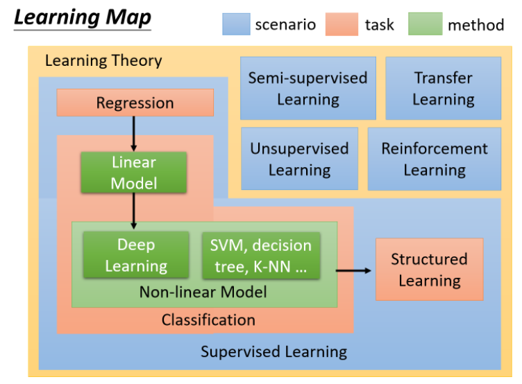

[TOC]

# P1 0-1:Introduction of Machine Learning <!--介绍内容  38'-->

## 机器学习简要概述

<u>	人工智能</u>是我们想要达成的目标，<u>机器学习</u>是想要达成目标的手段，<u>深度学习</u>是机器学习其中一个方法

## eg.生物的本能：

​	河狸筑水坝：天生的本能，盖住流水声

## 机器的本能

1. 人类设定好的天生的本能：比如在聊天机器人里面设定一些规则
2. 当给chat-bot(聊天机器人)指令：Do not turn off the music==>仍然会关闭音乐==>手工规则的弱点
3. 没有办法考虑到所有的可能性，非常僵化
4. 没有办法超过他的创作者--即人类
5. 四格漫画：很多看起来很聪明的人工智能机器人里面都是if-else

## 机器学习就是自动找函数<u>Looking for a function from Data</u>

1. Speech Recognition 语音辨识:输入一段声音讯号，输出声音讯号的文字
2. Image Recognition 图像辨识:输入一张图片，输出图片里面有什么东西
3. Playing Go 下棋:棋盘上黑子和白子的位置，下一步要落子的位置
4. Dialogue System 对话系统:输入你要说的话，输出机器的回应

## 找出 Function 的 Framework(框架/结构)，以 Image Recognition 为例

​	目标：找出一个 Function，输入一张图片，Function告诉我们图片里有什么东西,数据集训练的部分叫 Training，测试的部分叫 Testing

- step1:准备 model = A set of Function (set 里面有成千上万的 Function f1,f2..)：**define a set of Function**
- step2:有一些训练数据,告诉机器好的Function 的输入和输出应该长什么样子，机器根据 Train Data 判断一个 Function 是好还是不好==>loss: **goodness of function**
- step3:需要一个有效率的演算法从 Function set 里面挑出最好的 Function ==> f*，机器自动找出loss最低的函式,使用Gradient Descent方法:**pick the best function**

## Learning Map

1. 蓝色方块指的是scenario，即学习的情境。通常学习的情境是我们没有办法控制的，比如做reinforcement Learning是因为我们没有data、没有办法来做supervised Learning的情况下才去做的。**如果有data，supervised Learning当然比reinforcement Learning要好；**因此手上有什么样的data，就决定你使用什么样的scenario
2. 红色方块指的是task，即要解决的问题。你要解的问题，随着你要找的function的output的不同，有输出scalar的regression、有输出options的classification、有输出structured object的structured Learning…
3. 绿色的方块指的是model，即用来解决问题的模型(function set)。在这些task里面有不同的model，也就是说，同样的task，我们可以用不同的方法来解它，比如linear model、Non-linear model(deep Learning、SVM、decision tree、K-NN…)

### Supervised Learning 有监督学习 

supervised learning 需要大量的training data，这些training data告诉我们说，一个我们要找的function，它的input和output之间有什么样的关系

而这种function的output，通常被叫做label(标签)，也就是说，我们要使用supervised learning这样一种技术，我们需要告诉机器，function的input和output分别是什么，而这种output通常是通过人工的方式标注出来的，因此称为人工标注的label，它的缺点是需要大量的人工effort

#### Regression 回归 

==> 特点是通过regression找到的function，它的输出是一个scalar数值: eg.预测明天上午的 PM2.5

#### Classification 分类

Binary Classification **二分类** ，输出是或否：eg.垃圾邮件分类，输入是邮件，输出是该邮件是否是垃圾邮件

Multi-class Classification **多分类**，让机器做选择题： eg.新闻主题分类，输入是一则新闻，输出是这个新闻属于哪一个类别(选项)

##### model(function set) 选择模型

- Linear model
- **Non-linear Model**
  - **deep learning**：影像辨识，下围棋
  - SVM
  - decision tree
  - K-NN

### Semi-Supervised Learning 半监督学习

举例：如果想要做一个区分猫和狗的function

手头上有少量的labeled data，它们标注了图片上哪只是猫哪只是狗；同时又有大量的unlabeled data，它们仅仅只有猫和狗的图片，但没有标注去告诉机器哪只是猫哪只是狗

在Semi-supervised Learning的技术里面，这些没有labeled的data，对机器学习也是有帮助的

### Transfer Learning 测试资料和训练资料不完全相同

假设一样我们要做猫和狗的分类问题

我们也一样只有少量的有labeled的data；但是我们现在有**大量的不相干的data**(不是猫和狗的图片，而是一些其他不相干的图片)，在这些大量的data里面，它可能有label也可能没有label

Transfer Learning要解决的问题是，这一堆不相干的data可以对结果带来什么样的帮助

### UnSupervised Learning 无监督学习没有label

区别于supervised learning，unsupervised learning希望机器学到无师自通，在完全没有任何label的情况下，机器到底能学到什么样的知识

举例来说，如果我们给机器看大量的文章，机器看过大量的文章之后，它到底能够学到什么事情？它能不能学会每个词汇的意思？

学会每个词汇的意思可以理解为：我们要找一个function，然后把一个词汇丢进去，机器要输出告诉你说这个词汇是什么意思，也许他用一个向量来表示这个词汇的不同的特性，不同的attribute

又比如，我们带机器去逛动物园，给他看大量的动物的图片，对于unsupervised learning来说，我们的data中只有给function的输入的大量图片，没有任何的输出标注；在这种情况下，机器该怎么学会根据testing data的输入来自己生成新的图片？

### Structured Learning(结构化学习)

在structured Learning里，我们要机器输出的是，一个有**结构性**的东西

在分类的问题中，机器输出的只是一个选项；在structured类的problem里面，机器要输出的是一个复杂的物件

举例来说，在语音识别的情境下，机器的输入是一个声音信号，输出是一个句子；句子是由许多词汇拼凑而成，它是一个有结构性的object

或者说机器翻译、人脸识别(标出不同的人的名称)

比如**GAN**也是structured Learning的一种方法

### Reinforcement Learning 强化学习  Learning for critics 从评价中学习

**Supervised Learning**：我们会告诉机器正确的答案是什么 ，其特点是**Learning from teacher**

比如训练一个聊天机器人，告诉他如果使用者说了“Hello”，你就说“Hi”；如果使用者说了“Bye bye”，你就说“Good bye”；就好像有一个家教在它的旁边手把手地教他每一件事情

**Reinforcement Learning**：我们没有告诉机器正确的答案是什么，机器最终得到的只有一个分数，<u>就是它做的好还是不好</u>，但他不知道自己到底哪里做的不好，他也没有正确的答案；很像真实社会中的学习，你没有一个正确的答案，你只知道自己是做得好还是不好。其特点是**Learning from critics**，符合人类真是学习情境

​		比如训练一个聊天机器人，让它跟客人直接对话；如果客人勃然大怒把电话挂掉了，那机器就学到一件事情，刚才做错了，它不知道自己哪里做错了，必须自己回去反省检讨到底要如何改进，比如一开始不应该打招呼吗？还是中间不能骂脏话之类的

再拿下棋这件事举例，supervised Learning是说看到眼前这个棋盘，告诉机器下一步要走什么位置；而reinforcement Learning是说让机器和对手互弈，下了好几手之后赢了，机器就知道这一局棋下的不错，但是到底哪一步是赢的关键，机器是不知道的，他只知道自己是赢了还是输了

其实Alpha Go是用supervised Learning+reinforcement Learning的方式去学习的，机器先是从棋谱学习，有棋谱就可以做supervised的学习；之后再做reinforcement Learning，<u>机器的对手是另外一台机器</u>，Alpha Go就是和自己下棋，然后不断的进步

====================================================================

Reward引导机器学习的方向，机器自己想办法提高胜率
Explainable Ai (觉得图片里有猫的原因)
Adversarial attack（神奇的杂讯？）
Network compression（缩小network）
Anomaly detection异常检测，机器看到奇怪的东西能够知道：我不知道
Meta learning 学习如何学习（机器凭借后天努力，不聪明，目的让机器变聪明）
Life-long learning 终身学习（可以完成多任务）/continuous learning/never ending learning/increment learning

你想要找什么函式，希望机器帮你找什么样的函式，函式的不同有不同机器学习的任务,如果可以用 Supervised Learning，则不应该用Reinforcement Learning

RNN，输入是句子，输出结果句子是正面还是负面的

CNN输入图片，输出机器是哪一种类型的食物
Generation 生成，产生有结构的复杂东西（文字，图片）

# P2 0-2:Why we need to learn Machine Learning? <!--机器人说的 2'-->